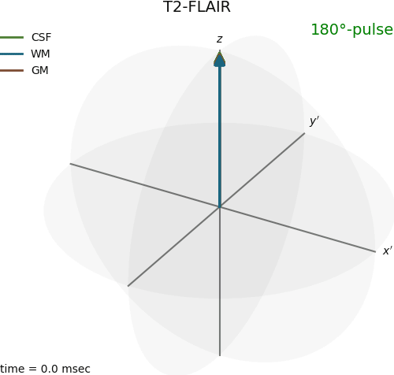

*Copyright (c) 2017-2025 Johan Berglund*  
*BlochBuster is distributed under the terms of the GNU General Public License*

*This program is free software: you can redistribute it and/or modify it under the terms of the GNU General Public License as published by the Free Software Foundation, either version 3 of the License, or (at your option) any later version.*

*This program is distributed in the hope that it will be useful, but WITHOUT ANY WARRANTY; without even the implied warranty of MERCHANTABILITY or FITNESS FOR A PARTICULAR PURPOSE.  See the GNU General Public License for more details.*

*You should have received a copy of the GNU General Public License along with this program.  If not, see <http://www.gnu.org/licenses/>.*

ABOUT
-----
BlochBuster is a nuclear magnetic resonance Bloch equation simulator written in Python. 
It simulates magnetization vectors based on the Bloch equations, including precession, relaxation, and excitation. 
BlochBuster outputs animated gif or mp4 files, which can be 3D plots of the magnetization vectors, plots of transverse and longitudinal magnetization, or pulse sequence diagrams.
Input paramaters are provided by human readable configuration files.
The animations are made using ffmpeg.
Pulse sequences may include arbitrary RF pulses and gradient fields.

CONFIG FILES
------------
The configuration files are in yaml-format. 
See example configuration file `config/example.yml` provided with BlochBuster for an example of supported features. 
RF pulses and gradient waveforms may be specified in separate yaml-files.

The "pulseSeq" field is a list of events such as RF pulses, gradients or spoiling. 
Each event happens at given time "t" [msec] with duration "dur" [msec].
An RF event may have a "FA" denoting the prescribed flip angle, and/or a "B1" vector [&mu;T] that determines the RF waveform played over the duration of the event. 
The waveform may be provided as a struct with fields "amp" [&mu;T] and optionally "phase" [°] for phase modulated pulses. 
If no B1 is provided, a hard pulse is assumed.
Optionally, the global phase of the RF pulse can be altered by specifying a "phase" [°] in the pulse sequence event.

A gradient event is specified by "Gx", "Gy", and/or "Gz" [mT/m]. 
These may be given as vectors, enabling arbitrary waveforms.
A graident may be played together with an RF-pulse, if "Gx", "Gy", and/or "Gz" are specified in the RF event.
A spoiler event is indicated by "spoil: true", and magically spoils all transverse magnetization. 

B1, Gx, Gy, and Gy may be loaded from a yaml file by providing the filename as a string. 
The file should contain the waveform as a list, or B1 at keys 'amp' and/or 'phase' as lists and G as a list at key 'grad'.

The pulse sequence repeats after "TR" msec, with "nTR" repetitions. "nDummies" may be used to play dummy TR:s before the plotted TR:s to achieve a steady state.

The main field "B0" is given in T.

The "components" field is a list of components/tissues, each represented by a magnetization vector with a distinct color in the plot. 
Each component's "name" will be printed in the legend. 
"CS" is chemical shift in ppm; "T1" and "T2" are relaxation times in msec. 
A components may have a velocity specified by "vx"/"vy"/"vz" [mm/sec] and diffusion specified by "Dx"/"Dy"/"Dz" [mm^2/sec].

Each component may be represented by a fan of "nIsochromats" vectors, with a distribution of precession frequencies determined by "isochromatStep" [ppm].

The optional "locations" field should contain a 3D matrix, indicating the equilibrium magnetization at different spatial positions.
One matrix can be given for each component, but their shapes must match.
The spacing between positions can be specified by "locSpacing" [m] (defaults to 1 mm).

If an initial state other than equilibrium is desired, it can be specified in the "M0" field by a matrix matching the shape of "locations" with an additional inner dimension of size 3 representing vector length, polar angle [°], and azimuthal angle [°].

White background can be toggled by setting "color: white" under the "background" field.

The animation speed is determined by the "speed" field, where 1 corresponds to real-time. Varying animation speed over the TR can be achieved by providing "speed" as a list where each element has field "t" [msec] and "speed". The maximum animation speed of RF pulses can be controlled by the "maxRFspeed" field (default is 0.001).

The output is specified by a list, where the "type" can be:
- 3D: animated 3D plot of the magnetization vectors. The coordinate system may rotate relative to the resonance frequency by specifying "rotate" in [Hz]
- kspace: animated plot of kspace position
- psd: events plotted as a pulse sequence diagram
- xy: animated plot of transverse magnetization over time. If "abs: false", both real and imaginary components are plotted.
- z: animated plot of transverse magnetization over time

The filename is specified by "file". The file ending can be .gif or .mp4.
Freeze frames can be saved as .png by specifying "freeze" as a list of desired time points [msec].

HOW TO USE
----------
`Example 1: python BlochBuster.py -c "config/SE.yml"`

`Example 2: python BlochBuster.py -c "config/SpEnc.yml" -l 5`

The -c flag specifies which configuration file to use as input.  
The -l flag is optional and specifies a leap factor, allowing frames to be skipped when generating the animation file. This enables fast preview for testing.  

DEPENDENCIES
------------
See [./pyproject.toml](pyproject.toml).

CONTACT INFORMATION
-------------------
Johan Berglund, Ph.D.  
Uppsala University Hospital,  
Uppsala, Sweden  
johan.berglund@akademiska.se